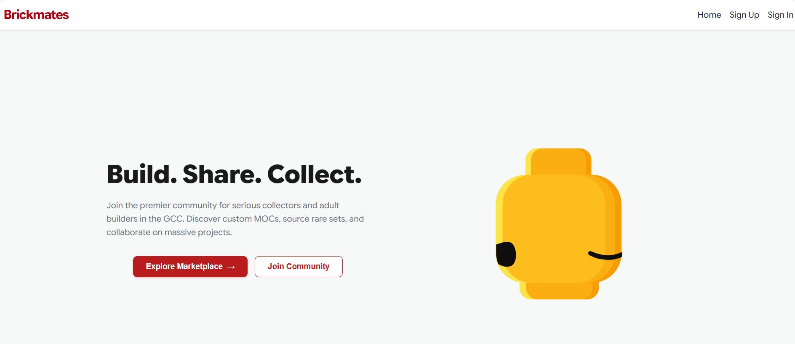

# BrickMates 🧱

_A social platform and marketplace for LEGO builders and collectors — share builds, trade sets, and find people to build with._



### Use the App

[Deployed App Link](https://brickmates-site.netlify.app)

### BACKEND Repository

[BrickMates BACKEND](https://github.com/zainabahmed-star/brickmates-back.git)

### How to Use

1. **Sign Up / Sign In**: Create an account to start building your profile.
2. **Browse Sets**: Search the live LEGO catalog and add sets to your personal collection.
3. **Post a Build**: Share a photo or video of your latest build, official set or MOC.
4. **Engage**: Like and comment on other builders' posts, and follow the ones you like.
5. **Trade**: Buy and sell sets through the built-in marketplace.
6. **Build Together**: Join the queue for a set, get matched with another builder, and jump into a live video call to build side by side.

### Installation

Clone the repository and install dependencies:

```bash
git clone https://github.com/your-username/brickmates-frontend.git
cd brickmates-frontend
npm install
```

Create a `.env` file in the project root:

```
VITE_BACK_END_SERVER_URL=http://localhost:3000
```

Run the app locally:

```bash
npm run dev
```

The app will be available at `http://localhost:5173`.

> **Note:** This app requires the [BrickMates API](http://linktobackendrepo.com) running to function see that repo for backend setup instructions.

### Technologies Used

- **React** — UI and component architecture
- **React Router** — client-side routing
- **Vite** — build tooling and dev server
- **Socket.io Client** — real-time messaging
- **Stream Video React SDK** — live video calls for Build Together
- **react-hot-toast** — in-app notifications
- **Cloudinary** — image and video hosting (via the backend)

### Credits

We would like to thank our great Instructor ms.Nabila and our incredible IAs Zainab and Bidoor.

### Contributing

Feel free to fork this repository and submit pull requests to contribute to the development of BrickMates. For major changes, please open an issue first to discuss what you would like to change.
